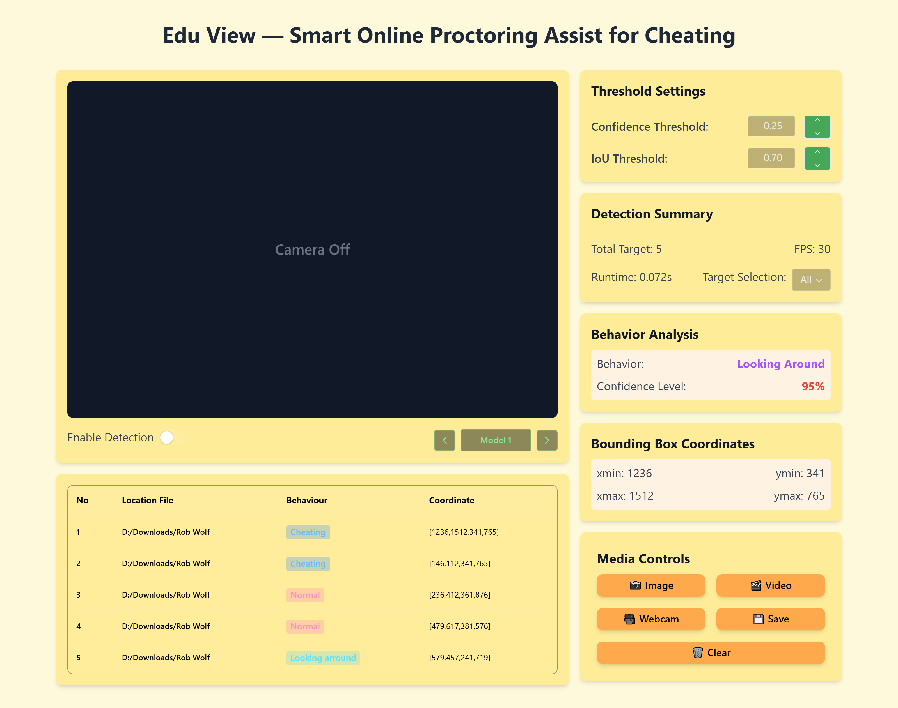

# **Edu View — Smart Online Proctoring Assist for Cheating**

Edu View is an AI-powered system designed to detect cheating in both offline and online exams using real-time monitoring with cameras, head movement tracking, and object recognition. This ensures a fair exam environment and improves the quality of assessments.

## **📌 Features**

### 1️⃣ AI Real-Time Cheating Detection

#### ⚡ Problem
During exams, some student maybe doing cheating to get better results. But if keep doing that, it can impact the quality of student and their future. The teacher or exam overseer also cannot monitoring all student at once.

#### ✅ Solution
Edu View use AI system with camera monitoring to detect cheating behavior in real-time. The system helps teacher to identify cheating attempts and prevent unfair advantage, making students more prepared before exams.

---

### 2️⃣ Head Movement Tracking & Object Recognition

#### ⚡ Problem
Online exams make it hard to ensure student not doing cheating because teacher can't see directly what they doing. Student can easily look at notes, search internet, or get help without being noticed.

#### ✅ Solution
Edu View track head movement and detect objects around student during online exam. It can detect if student looking away from screen too much or if suspicious objects like books, phones, or other people appear nearby. Using YOLO for object detection and special algorithm for head tracking, teacher can focus more on exam instead of cheating concerns.

---

### 3️⃣ Eye and Mouth Activity Analysis for Silent Cheating Detection

#### ⚡ Problem
Some student develop silent cheat method like moving only their eyes to look at hidden notes, whispering answer to microphone, or secret mouth movements. Current monitoring system usually can't catch these subtle behaviors.

#### ✅ Solution
Edu View AI system focus on eye and mouth activity to detect silent cheating. It track suspicious eye movements like looking down or to side repeatedly, unusual mouth movements like whispering, and can detect if student speaking quietly. This make online exams more fair for everyone.

---

## **🎨 App View**


---

## **⚙️ Tech Stack**
- **Framework:** Reflex (Frontend & Backend)
- **Computer Vision:** YOLO for object detection
- **Facial Recognition:** Mediapipe
- **Deep Learning:** Convolutional Neural Networks (CNN)

---

## **🚀 Getting Started**

1. Clone this repository:
   ```sh
   git clone https://github.com/Laoode/EduView.git
   cd eduview
   ```
2. Set up a virtual environment:
   - For Windows users:
   ```sh
    python -m venv venv
    . venv/Scripts/activate
   ```
   - For macOS and Linux users:
   ```sh
    python3 -m venv venv
    source venv/bin/activate
   ```
3. Install dependencies:
   ```sh
   pip install -r requirements.txt
   ```
3. Run the application:
   ```sh
   reflex run
   ```
4. Open browser and access:
   ```
   http://localhost:3000
   ```

---

## **📜 License**
This project is licensed under the MIT License.

---

## **📞 Contact**
If you have any questions or feedback, feel free to reach out!

